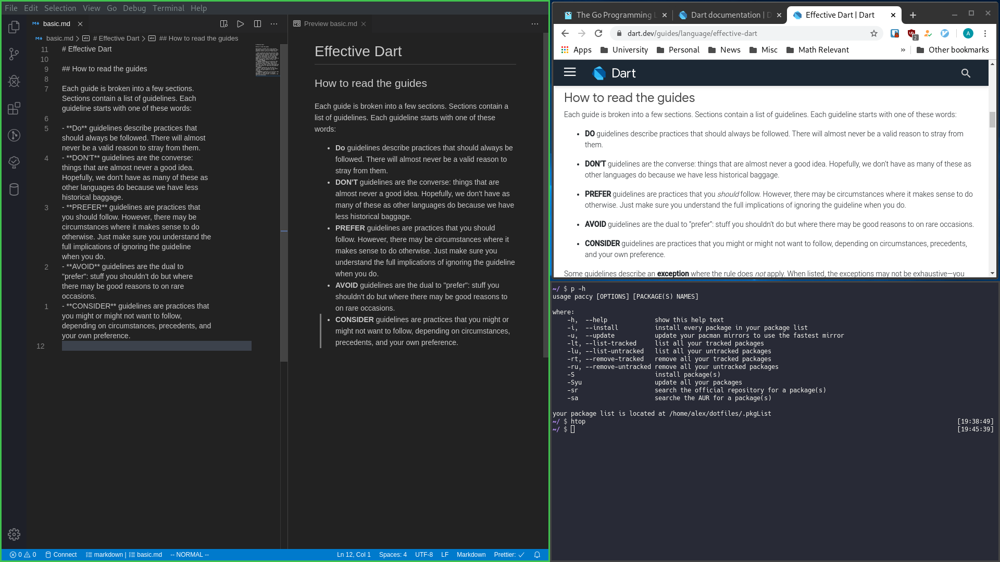

# Dotfiles

Arch Linux can be installed by my installation script found here on my [Github](https://github.com/ALX99/Arch-AI).  
The dotfiles here are meant for my own usage and uploaded for the sake of sharing. If you for some reason would like to try them out run the `setup` script after Arch Linux is installed.

If the keybindings look weird it's because they are. Reason being I use Colemak-DH as a keyboard layout.  
Packages I use are found under [.pkgList](https://github.com/ALX99/dotfiles/blob/master/.pkgList) and are managed by my pacman/yay wrapper [paccy](https://github.com/ALX99/dotfiles/blob/master/bin/paccy).

Boring picture of the boring setup below.

