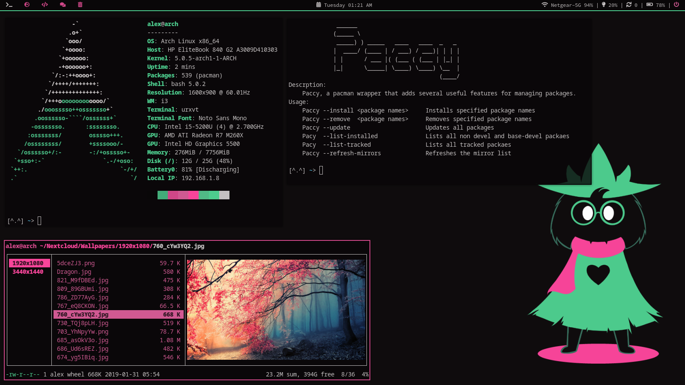
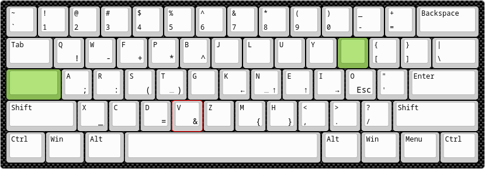

# Dotfiles

Here are some dotfiles.

## Screenshot

## Requirements

* **Everything is listed in .pkgList**

## TODO (High to low priority)

* improve paccy
* fix installation script for my dotfiles
* Improve VIM config

## Keyboard layout

