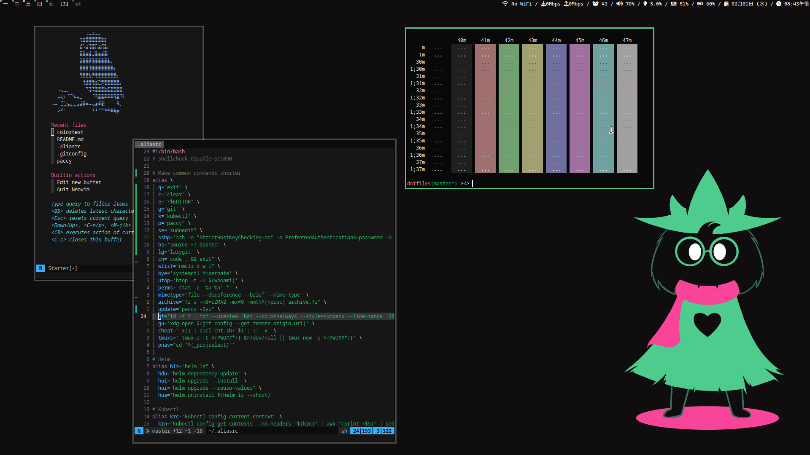
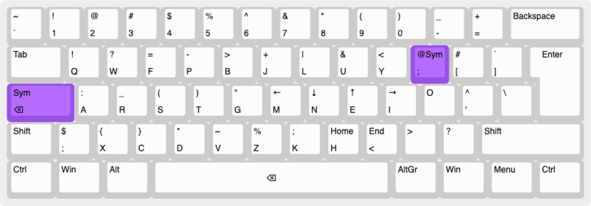

# dotfiles

These dotfiles are primarily uploaded for personal backup & sync purposes, 
however you may discover useful aliases and scripts within as I tend to use the 
shell extensively.

Here's an overview of what you can find in this repository:

- [.profile](https://github.com/ALX99/dotfiles/blob/master/home/.profile)
      - Generic profile
- [.bash_profile](https://github.com/ALX99/dotfiles/blob/master/home/.bash_profile)
      - Links to .profile
- [.bashrc](https://github.com/ALX99/dotfiles/blob/master/home/.bashrc)
      - Bashrc
- [.bashrc.d/](https://github.com/ALX99/dotfiles/tree/master/home/.bashrc.d)
      - Bashrc includes
- [.aliasrc](https://github.com/ALX99/dotfiles/blob/master/home/.aliasrc)
      - Aliases
- [.inputrc](https://github.com/ALX99/dotfiles/blob/master/home/.inputrc)
      - Readline config
- [.gitconfig](https://github.com/ALX99/dotfiles/blob/master/home/.gitconfig)
      - Git config
- [.gitalias](https://github.com/ALX99/dotfiles/blob/master/home/.gitalias)
      - Git aliases
- [.ssh/config](https://github.com/ALX99/dotfiles/blob/master/home/.ssh/config)
      - SSH config
- [.privrc](https://github.com/ALX99/dotfiles/blob/master/home/.privrc)
      - Private config
- [bin/](https://github.com/ALX99/dotfiles/tree/master/.local/bin)
      - Shell scripts
- [.config/](https://github.com/ALX99/dotfiles/tree/master/.config)
      - Program configs
- [.config/nvim](https://github.com/ALX99/dotfiles/tree/master/.config/nvim)
      - Neovim config
- [.config/hypr](https://github.com/ALX99/dotfiles/tree/master/.config/hypr)
      - Hyprland config
- [.config/ghostty](https://github.com/ALX99/dotfiles/tree/master/.config/ghostty)
      - Ghostty terminal config
- [.config/mpv](https://github.com/ALX99/dotfiles/tree/master/.config/mpv)
      - MPV config (with [subs2srs](https://github.com/Ajatt-Tools/mpvacious) submodule)
- [.config/fcitx5](https://github.com/ALX99/dotfiles/tree/master/.config/fcitx5)
      - Fcitx5 input method
- [.config/karabiner](https://github.com/ALX99/dotfiles/tree/master/.config/karabiner)
      - Karabiner-Elements config (macOS Colemak-DH)
- [.devcontainer/](https://github.com/ALX99/dotfiles/tree/master/.devcontainer)
      - DevContainer setup and the Alpine Linux `sbx` agent sandbox image
- [.github/](https://github.com/ALX99/dotfiles/tree/master/.github)
      - CI: extension checks, ShellCheck, dependabot, automerge
- [misc/](https://github.com/ALX99/dotfiles/tree/master/misc)
      - System-level configs (systemd, keymaps, pacman-hooks)
- [data_analysis/](https://github.com/ALX99/dotfiles/tree/master/data_analysis)
      - Pi JSONL analytics (local Plotly report generator)
- [Justfile](https://github.com/ALX99/dotfiles/blob/master/Justfile)
      - Installation, formatting, and validation recipes
- [.pkgList](https://github.com/ALX99/dotfiles/blob/master/.pkgList)
      - Arch package manifest for provisioning fresh systems
- [.stowrc](https://github.com/ALX99/dotfiles/blob/master/.stowrc)
      - Stow config (no-folding)
- [.gitmodules](https://github.com/ALX99/dotfiles/blob/master/.gitmodules)
      - Git submodules

## Agent sandbox

`sbx -- <command>` builds and runs a native-architecture Alpine Linux container
for AI-agent work. It mounts only the current Git repository read-write, at the
same absolute path used by the host, and rejects repositories outside
`~/dotfiles` and `~/projects`. Submodules use their top-level superproject, and
linked worktrees also mount their external Git metadata.

Claude Code, Pi, and Codex are installed in the image. Their normal
`~/.claude`, `~/.pi`, and `~/.codex` directories are mounted read-write, along
with `~/.claude.json` and `~/.agents`, so authentication, sessions, JSONL
history, and other state are shared directly with the host. The dotfiles
repository is additionally mounted read-only when it is not the active
workspace so its configuration symlinks continue to resolve.

Pi's npm and git package directories and extension `node_modules` are the only
exceptions. Native macOS dependencies cannot run on Alpine, so Linux copies
persist under `~/.local/share/sbx/pi-linux`. They are installed once and reused
on later runs. The host Go module cache (`~/go/pkg/mod`) and pnpm
content-addressed store (`~/.local/share/pnpm/store`) are mounted read-write so
dependency downloads are shared across host and sandbox environments.

The container has a read-only root filesystem, no Linux capabilities, a
container-only temporary directory, and no access to the Docker socket or other
projects. The host must have an authenticated GitHub CLI; its token is always
passed as `GH_TOKEN`, and sandbox Git rewrites GitHub SSH URLs to authenticated
HTTPS.

Every invocation lets Docker check its build cache. Use
`sbx --rebuild -- <command>` to pull the base image and rebuild without cache,
or set `SBX_NETWORK=none` to run without network access.

## things

### good software

- distro: [arch](https://archlinux.org/)
- wayland compositor: [hyprland](https://hypr.land/)
- browser: [brave](https://brave.com/)
- editor: [neovim](https://neovim.io/)
- terminal emulator: [ghostty](https://ghostty.org/)
- terminal multiplexer: [tmux](https://github.com/tmux/tmux)
- shell: [bash](https://www.gnu.org/software/bash/)
- keyboard manager: [keyd](https://github.com/rvaiya/keyd)
- macOS Karabiner-Elements: Colemak-DH on macOS
- app launcher: [fuzzel](https://github.com/dennistn/fuzzel)
- status bar: [waybar](https://github.com/Alexays/Waybar)
- file manager: [pcmanfm](https://github.com/lxde/pcmanfm)
- image viewer: [imv](https://github.com/shinichiro-hama/imv)
- PDF viewer: [zathura](https://pwmt.org/zathura/)
- video player: [mpv](https://mpv.io/)
- notification daemon: [dunst](https://github.com/dunst-project/dunst)

### picture

### keyboard

[colemak dh](https://colemakmods.github.io/mod-dh/) is nice

