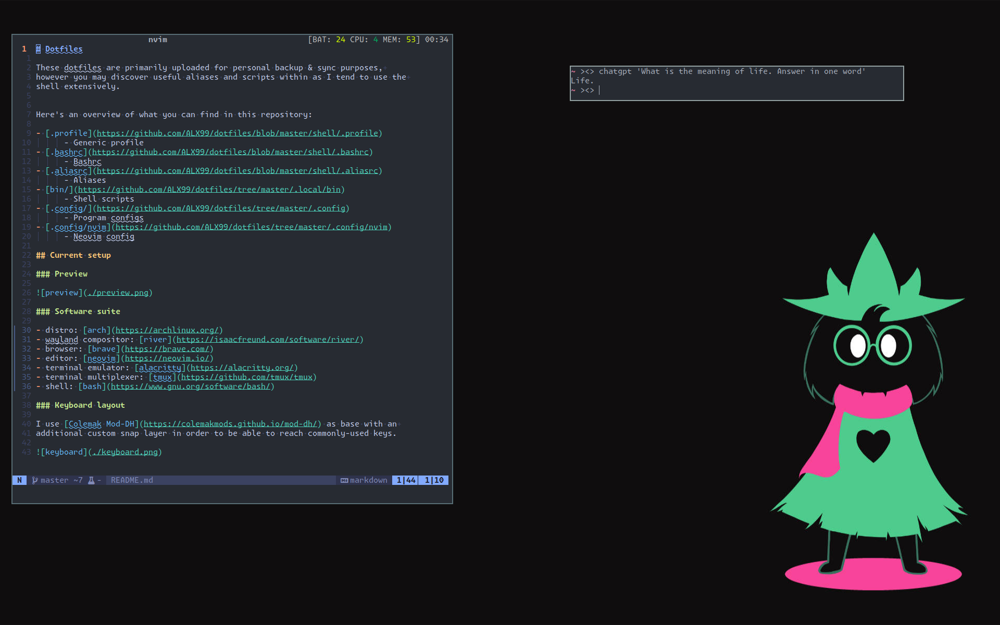
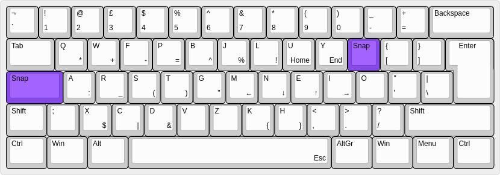

# Dotfiles

These dotfiles are primarily uploaded for personal backup & sync purposes, 
however you may discover useful aliases and scripts within as I tend to use the 
shell extensively.

Here's an overview of what you can find in this repository:

- [.profile](https://github.com/ALX99/dotfiles/blob/master/shell/.profile)
      - Generic profile
- [.bashrc](https://github.com/ALX99/dotfiles/blob/master/shell/.bashrc)
      - Bashrc
- [.aliasrc](https://github.com/ALX99/dotfiles/blob/master/shell/.aliasrc)
      - Aliases
- [bin/](https://github.com/ALX99/dotfiles/tree/master/.local/bin)
      - Shell scripts
- [.config/](https://github.com/ALX99/dotfiles/tree/master/.config)
      - Program configs
- [.config/nvim](https://github.com/ALX99/dotfiles/tree/master/.config/nvim)
      - Neovim config

## Current setup

### Preview

### Software suite

- Window Manager: [dwm](https://dwm.suckless.org/)
- Menu Bar: [dmenu](https://tools.suckless.org/dmenu/)
- Browser: [Brave](https://brave.com/)
- Editor: [Neovim](https://neovim.io/)
- Terminal Emulator: [st](https://st.suckless.org/)
- Terminal Multiplexer: [tmux](https://github.com/tmux/tmux)
- Shell: [bash](https://www.gnu.org/software/bash/)

### Keyboard layout

I use [Colemak Mod-DH](https://colemakmods.github.io/mod-dh/) as base with an 
additional custom snap layer in order to be able to reach commonly-used keys.

